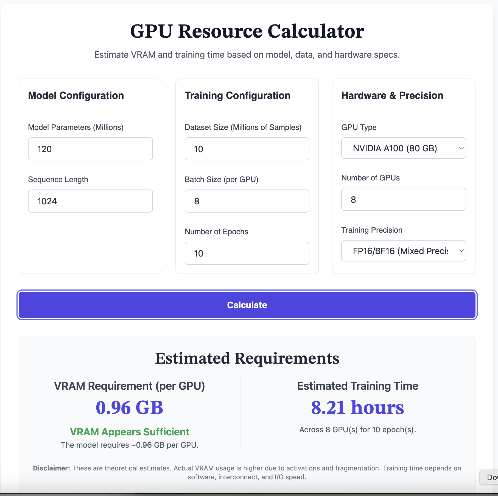

### GPU Resource Calculator

A tool to help calculate and optimize GPU resource allocation for machine learning workloads. This calculator helps users determine the optimal GPU configuration based on their specific requirements and constraints.

## Features
- Calculate optimal GPU configuration
- Estimate resource requirements
- Compare different GPU setups
- Optimize for cost and performance

## Usage
[Add usage instructions here]

## Requirements
[Add requirements here]

